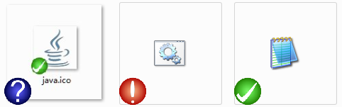

# 文件关联工具
本工具可以用来为你的便携程序添加文件关联，比如 nodepad2.exe 、 vscode 或其他图片处理程序，而不仅仅是 sublime text 。

## 使用方法
把要关联的程序比如 nodepad2.exe 拖入本工具的窗口即可进行操作。

- [x] 添加右键菜单
- [x] 关联扩展名(与程序同目录的 ext.txt 文件中)
- [x] 关联图标
- [x] 取消关联扩展名
- [x] 取消添加右键菜单
- [ ] 图标叠加

想实现图标叠加效果，类似下图。当一些文件关联某个软件以后，这些文件除了拥有本身类型的图标以外，还叠加一个小图标，也就是当前关联的程序。

谷歌了半天，好像没有可以直接使用的方法。叠加的图标要调用 shell 接口先进行注册……

## 鸣谢
- Sublime-Text-Portable-Tool
- vscode-icons
- svgexport
- png2ico
